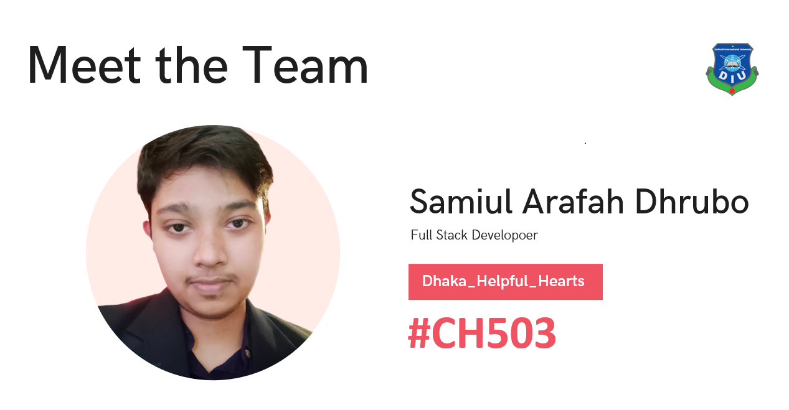
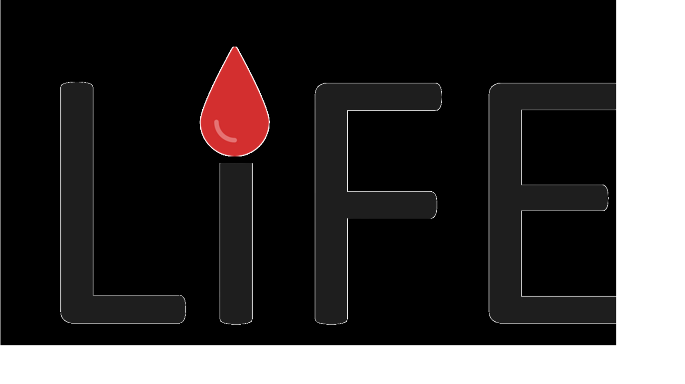

# CTO FORUM INNOVATION HACKATHON
## TEAM DHAKA_HELPFUL_HEARTS (CH503)
## Challange: Good Health and Well Being
[](media/image/team.png)

# Presenting Blood Sharing app

[](media/image/life.svg)

### Used Technologies:
- html, css, bootstrap, js
- Django
- Mysql

### Features (Blood Seeker)
```
- Authentication
- Blood seekers can post  
- Search available blood donors near him/her
- Filter donors by location or blood group
- see last donations of a donor
- Change status "Managed" if blood is managed
- Share blood seeking post in facebook
- See responses and offered blood amount
- Accept blood seeking post responses
```

### Features (Blood Donor)
```
- Authentication
- Find out blood seeking post by location or blood group 
- Response on blood seeking posts
- See last donation
- Get rewards after successful donations
- Share banners in social media
```

### Features (Community Admin)
```
- Authentication
- Create Blood Donation Community 
- Update Donation Community
- get requests from blood seekers
- responses to the posts
- Share the post social media/admin's blood donation community
```
### Through our app, we are solving blood seekers issues:
```ssh
- Getting information of nearby blood donors
- Engaging blood donors as soon as possible
- Safe blood with no fees
- No fees for our platform usage
- Minimizing dependency on hospitals and blood bank
- Reliable and large community
- Getting information of other blood sharing communities
```
